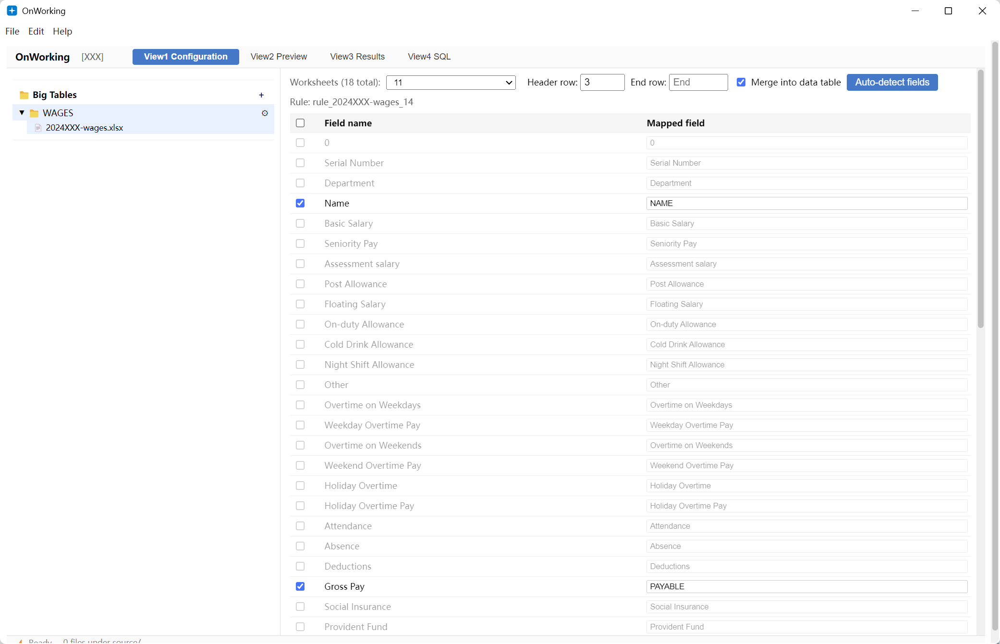
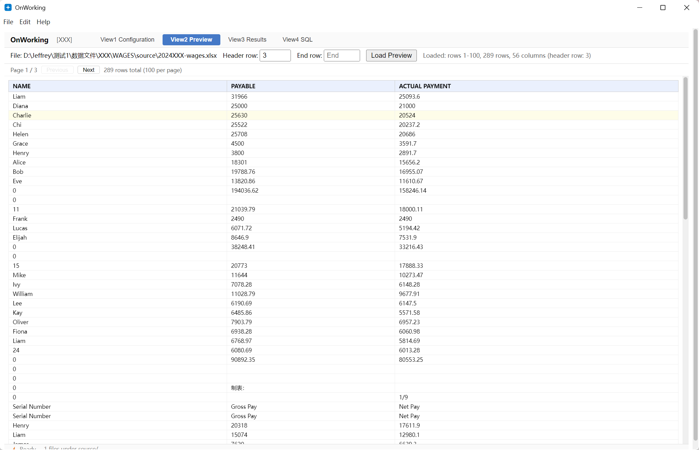
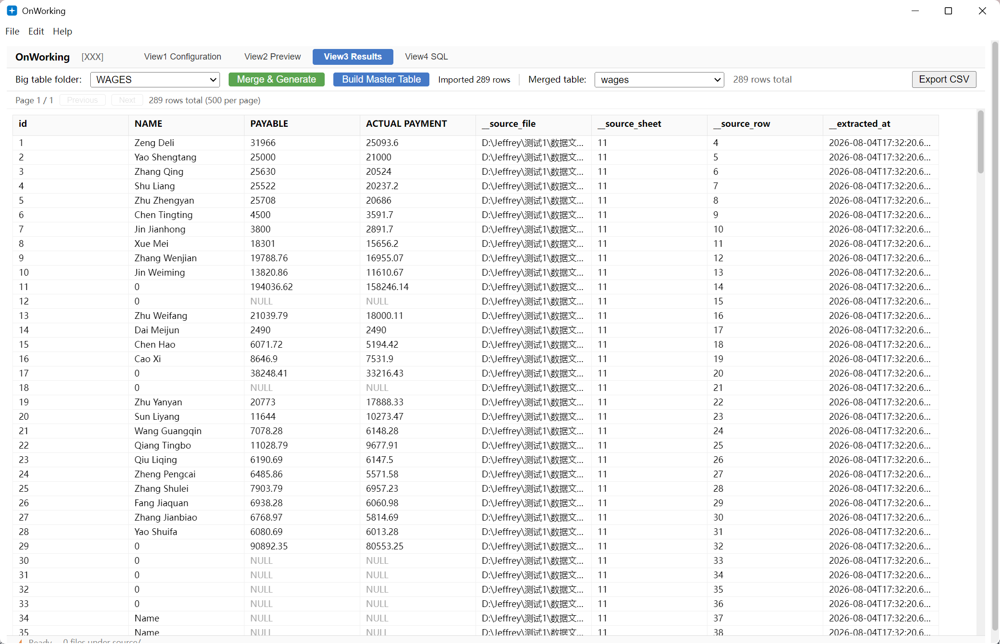
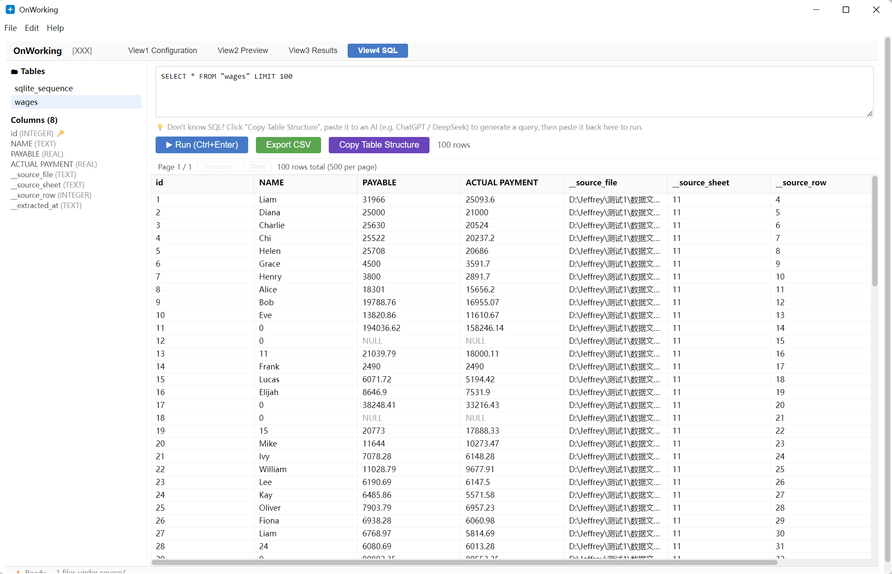

[English](README.md) | [简体中文](README.zh-CN.md)

# OnWorking

> 一个透明、规则驱动的 ETL 桌面应用，把散落的 Excel/CSV 文件整理成干净、可查询的数据表。

OnWorking 是一款桌面应用，用于把散落的、格式相近的 Excel/CSV 文件整理成干净、可查询的 SQLite 数据表。你不需要手工改表格——用一份纯文本的 YAML 规则描述每个文件该如何处理，OnWorking 就会把全部文件合并成一张表，并且每一行都能追溯到它来自哪个文件、哪个工作表、哪一行。

---

## 为什么选择 OnWorking？

财务和业务数据常常以几十个结构相似的 Excel 文件散落在各个文件夹里。手工清理、合并、对账既慢又容易出错——而且一旦数字被合并，没人能再把某个数字追溯回它来源的文件。

OnWorking 同时解决这两个问题：

- **用规则，而不是脚本。** 每个文件/工作表由一个声明式的 YAML 规则处理：读哪个工作表、哪一行是表头、数据到哪里截止、每一列如何映射到表字段、要应用哪些转换。规则是纯文本——人类可审阅，AI 工具也可读、可审计。
- **每一行都有溯源。** 每个合并后的行都保留来源：`__source_file`、`__source_sheet`、`__source_row`、`__extracted_at`。再也不用问「这个数字是从哪来的？」

## 功能特性

- **规则驱动的清洗** —— 把源列映射到表字段，带类型转换（文本 / 数字 / 日期 / 枚举 / 布尔）和行过滤。
- **金额用整数分存储** —— 金额以整数（×100）存储，避免浮点精度误差。
- **行级溯源** —— 每个合并行都带 `__source_file`、`__source_sheet`、`__source_row`、`__extracted_at`。
- **文件夹即数据表** —— 把同格式的文件放进一个文件夹，一键合并成一张表。
- **总表** —— 把工作区里所有大表文件夹聚合到一张总表。
- **SQL 工作台** —— 内置表浏览器、SQL 编辑器、一键导出 CSV（带 UTF-8 BOM，Excel 打开中文不乱码）。
- **自动生成规则** —— 从样本中检测列类型，生成一份入门规则。
- **支持 Excel 与 CSV** —— 读取 `.xlsx`、`.xls` 和 `.csv`。

## 工作原理

### 核心概念

| 概念 | 含义 |
|---|---|
| **工作区** | 承载数据的根目录：`source/` 放原始文件，`.onworking/` 放规则、设置和 SQLite 数据库。 |
| **大表** | 一个定义输出数据表的文件夹（`settings.json` = 表名、列、主键），带自己的 `source/` 文件夹和规则状态。 |
| **源文件** | 放入大表 `source/` 目录的 Excel 或 CSV 文件。 |
| **规则** | 描述一个文件/工作表如何映射进数据表的 YAML 文件：工作表、表头行、截止行、字段映射、转换、合并策略。 |

### 数据流

```
    Excel/CSV 文件 (source/)       规则 (YAML)
    ┌────────────────────────┐     ┌──────────────────────────────┐
    │ *.xlsx  *.xls  *.csv   │     │ rule_*.yaml                  │
    └───────────┬────────────┘     │ · 工作表 / 表头行            │
                │                  │ · 截止行                      │
                └──────────┬───────┤ · 字段映射                    │
                           │       │ · 转换                        │
                           ▼       │ · 合并策略                    │
               ┌──────────────────┐ └──────────────────────────────┘
               │    ETL 管道       │
               │ 扫描 → 解析 →     │
               │ 转换 →            │
               │ 校验 → 插入       │
               └─────────┬────────┘
                         ▼
              SQLite 大表（每个文件夹一张）
              + 溯源: __source_file,
                __source_sheet, __source_row,
                __extracted_at
                         │
        ┌────────────────┴────────────────┐
        ▼                                 ▼
 生成总表                         SQL 工作台
 (聚合所有文件夹)                  · 查询 · 导出 CSV
        │
        ▼
   总表
```

### 四个视图

应用是单窗口，包含四个视图：

- **配置** —— 主工作台：左侧是大表文件夹树，右侧是规则编辑器 / 数据表设置面板。
- **预览** —— 合并前源文件的翻页预览，表头和截止行高亮显示。
- **结果** —— 合并文件夹、生成总表、浏览结果、导出 CSV。
- **SQL** —— 表浏览器和 SQL 编辑器：执行查询、导出 CSV，或把表结构复制成 AI 友好的文本提示。

## 截图









## 快速开始

### 环境要求

- Node.js 18 或更新版本

### 开发模式运行

```bash
npm install
npm start
```

这会构建主进程、启动 Vite 开发服务器并启动 Electron。

### 打包安装包

```bash
npm run dist
```

输出到 `release/`（Windows 用 NSIS 安装包，macOS 用 DMG，Linux 用 AppImage）。

### 测试与类型检查

```bash
npm test
npm run typecheck
```

## 使用方法

一个典型的工作流：

1. **打开工作区** —— 选一个存放所有数据的文件夹。
2. **创建大表** —— 配置它的名称、列（文本 / 金额分 / 数字 / 日期）和可选主键。
3. **添加源文件** —— 把 `.xlsx` / `.xls` / `.csv` 文件放进大表的 `source/` 文件夹。
4. **编写规则** —— 为每个文件选择工作表、表头行和截止行，把每一列映射到表字段，并选择转换。或者点**自动检测**，从样本生成一份入门规则。
5. **合并文件夹** —— 所有源文件经过各自规则流入一张表，保留行级溯源。
6. **生成总表并查询** —— 聚合所有大表文件夹，然后在 SQL 工作台里探索数据或导出 CSV。

## 规则格式

规则以 YAML 形式存储在各大表的 `.onworking/rules/` 文件夹里。一个最小示例：

```yaml
name: rule_voucher_1
display: "Voucher book"
version: 1
sources:
  - pattern: "**/voucher.xls"   # 与该文件夹 source/ 匹配的 glob
    sheetIndex: 0
    headerRow: 1                # 表头所在行（从 1 开始）
    endRow: 10374               # 截止行（从 1 开始，省略则读到末尾）
fields:
  - sourceHeader: DATE          # 源文件中的列
    outputName: date
    included: true
    order: 1
    transforms:
      - kind: coerce_date
        formats: ["YYYY/M/D", "YYYY-MM-DD"]
        excelSerial: true
        fallbackStrategy: "null"
        aiRationale: "Date column"
  - sourceHeader: AMOUNT          # 金额列
    outputName: amount_cents
    included: true
    order: 2
    transforms:
      - kind: coerce_number
        outputType: cents       # 以整数分存储（×100）
        negativePattern: leading_dash
        aiRationale: "Money in cents to avoid float errors"
mergeStrategy:
  mode: append
```

### 转换（Transforms）

已实现的转换（按固定顺序应用）：

| 类型 | 用途 |
|---|---|
| `coerce_string` | 去首尾空白、转大小写、最大长度、空值列表。 |
| `coerce_number` | 解析数字/金额；处理千分位、小数分隔符和负数格式；`cents` 输出以整数分（×100）存储。 |
| `coerce_date` | 按声明的格式解析日期，包括 Excel 序列号。 |
| `coerce_enum` | 把源值映射到规范值。 |
| `coerce_boolean` | 映射真/假值集合。 |
| `filter_rows` | 按操作符（`eq`、`contains`、`regex`、`in` 等）过滤行。 |

每个转换都带一个必需的 `aiRationale` 字段，因此 AI 生成的规则必须解释每一步为什么这样应用——保持管道的透明和可审计。

## 项目结构

```
onworking/
├── src/
│   ├── common/                  # main 与 renderer 共享的类型与工具
│   │   └── types/               # rule / transform / parse-config 类型
│   ├── main/                    # Electron 主进程
│   │   ├── api/                 # 统一 IPC 路由
│   │   ├── db/                  # SQLite（worker 线程中的 better-sqlite3，WAL）
│   │   ├── etl/                 # ETL 管道：扫描器、解析器、转换、校验、插入
│   │   ├── rules/               # YAML 规则存储与编译器
│   │   ├── workspace/           # 工作区生命周期与管理
│   │   └── plugins/onw-excel/   # Excel/CSV 解析插件
│   └── renderer/                # React 界面
│       ├── components/          # 四个视图、规则编辑器、数据表、SQL 工作台
│       └── state/               # 客户端状态存储
└── tests/                       # 集成测试（vitest）
```

## 技术栈

| 层 | 技术 |
|---|---|
| 桌面外壳 | Electron 31 |
| 界面 | React 18 · TypeScript 5.6 |
| 打包 / 开发服务器 | Vite 6 |
| 表格引擎 | Univer（`@univerjs`） |
| 数据库 | 通过 better-sqlite3 使用 SQLite（worker 线程 + WAL） |
| Excel/CSV 解析 | SheetJS（`xlsx`） |
| 规则存储 | YAML（`js-yaml`） |
| 打包 | electron-builder（NSIS / DMG / AppImage） |
| 测试 | Vitest |

## 许可证

[Apache License 2.0](LICENSE) 授权。
